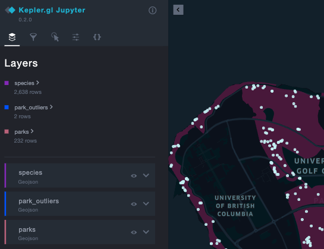
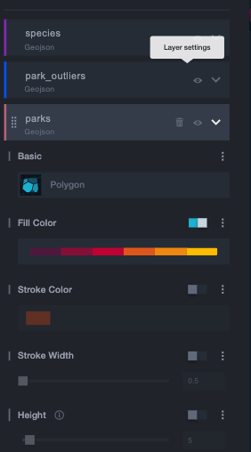
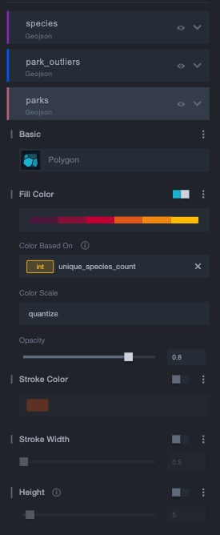

# Vancouver Park Biodiversity
A project to explore GBIF species occurrence data in Vancouver parks.

- Author: Lesley Miller 

# Final Report 
The final report detailing all the steps of the analysis can be ***[found here](https://aromatic-toast.github.io/vancouver_park_biodiversity/results/final_report.html)***.

# Mapping Park Observation Hotspots 
The final kepler map can be ***[found here](https://aromatic-toast.github.io/vancouver_park_biodiversity/results/final_report_map.html).***

### Exploring the kepler map
**1)** The hidden control panel on the left allows the user to view the layers of the map. All layers are turned on by default but can be toggled on and off by clicking on the eye icon on the layer. 

 
  

**2)** Expand the layer to change color scheme.

  
 

**3)** Color the parks by `unique_species_count` or `observation_count` by selecting the `Color Based On` option. 

  

# Research Question 
Urban parks provide an array of physical and psycholocial benefits to city residents. In addition to providing space for numerous recreational activities as well as natural beauty, urban parks can also provide an interface for residents to interact with wildlife through activities such as bird watching or mushroom picking. But how much of a city's biodiversity is observed in urban parks? More specifically, for residents who will record their sightings of wildlife (plants and animals) on citizen science websites, how much of these observations occur in urban parks? This project will explore the city parks of Vancouver, British Columbia and discover the types of biodiversity that is observed due to citizen science. The project will attemp to answer the following questions: 
1) What proportion of Vancouver's biodiversity data is recorded in an urban park? 
2) Which parks contain the most observations?
3) Which parks contain the largest number of different species?

# Data Sources 

## Global Biodiversity Information Facility 
[GBIF](https://www.gbif.org/) is a massive database that contains geotagged observation data for individual species (e.g. plant and animals). Species occurrence data was obtained from GBIF for City of Vancouver as well as the area of UBC and the Endowment Lands for the years between 2009 and 2019. 

## Local & Regional Greenspaces 
Geospatial data for Vancouver parks was obtained from the [BC Data Catalogue](https://catalogue.data.gov.bc.ca/dataset/local-and-regional-greenspaces).

# Analysis Plan 
1) Geotagged species observations will be spatially clipped to obtain the observations that occur within the spatial bounds of parks. 
2) The spatial distribution of parks will be mapped with an overlay of park species obsevations. 
3) The species counts for each park will be ranked to obtain the top 10 parks with the most observations. 
4) The species richness (count of unique species) will then be calculated for each park to obtain the top 10 parks with the highest species richness. 

# Data Pipeline 
1) `clean_data.py`
   - reads in raw data data and removes unnecessary columns on 
   parks and gbif data.
2) `get_species_metrics.py`
   - Clips gbif points to inside parks polygons and calculates species metrics per park. 
3) `visualize_kepler.py`
   - Reads in processed data and produces a kepler map from species and parks data layers.

# Dependencies 
- Python 3.8.2 and Python Packages:

  - pandas==1.0.4
  - geopandas==0.7.0
  - keplergl==0.2.0
  
- R 3.6.1 and R Packages: 

   - shiny
   - tidyverse
   - sf
   - knitr
   - gridExtra
   - grid
   - shinythemes
   - hrbrthemes
   
